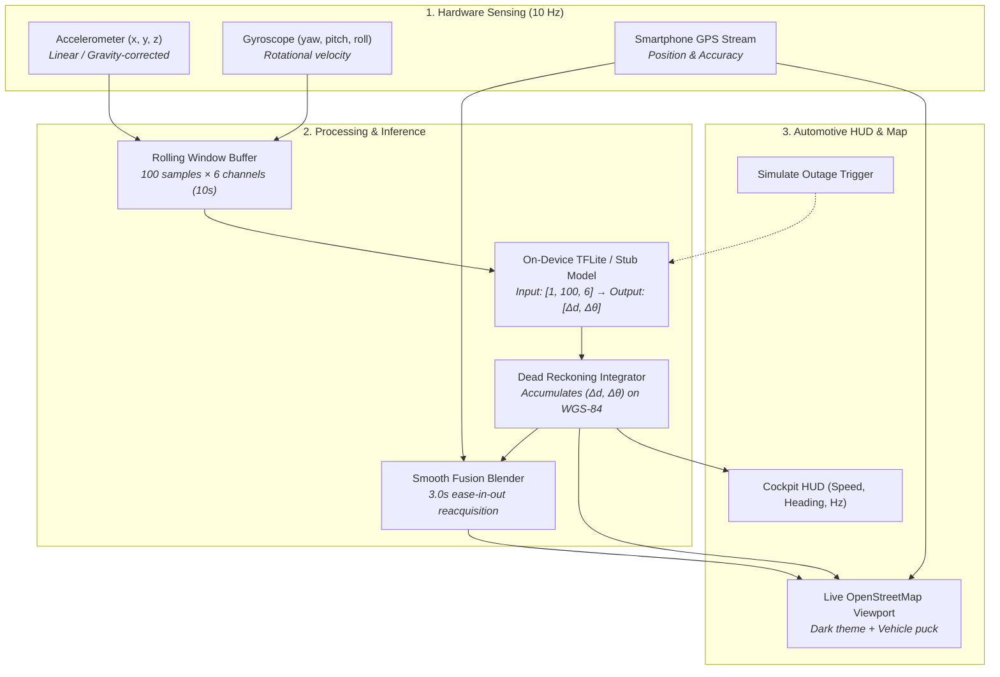

<div align="center">

# Reckon Companion App

**On-device learned inertial odometry for resilient ground-vehicle navigation.**

Keeping vehicles on the map through tunnels, underground parking, and GPS-denied environments.

[](https://flutter.dev)
[](https://www.tensorflow.org/lite)
[](https://www.openstreetmap.org/)
[](LICENSE)

</div>

---

## Overview

The **Reckon Companion App** is the client application that turns smartphone motion sensors into a continuous, drift-resilient vehicle tracker when GPS signals drop out or are actively jammed.

Rather than freezing on the map or jumping erratically when GPS signal returns, Reckon uses an on-device Long Short-Term Memory (LSTM) neural network (trained on the **IO-VNBD** benchmark dataset) to estimate vehicle displacement $(\Delta d, \Delta \theta)$ directly from 10 Hz accelerometer and gyroscope sequences.

### Key Features
- **Tri-Mode State Machine**: Seamlessly transitions across `GPS Active`, `Dead Reckoning (LSTM)`, and `Reacquisition & Fusion`.
- **Zero Paid Mapping APIs**: Built on `flutter_map` with OpenStreetMap raster and vector tiles, eliminating Mapbox / Google Maps SDK billing and API key limits.
- **Judge-Facing Demo Controls**: Built-in "Simulate Tunnel Outage" button allows live demonstration of GPS failover on stage without driving into a tunnel.
- **Real-Time Telemetry Inspector**: Visualizes live 10 Hz linear acceleration, gyroscope rotational rates, and TFLite inference latency (<15 ms).
- **Decoupled Architecture**: Features a built-in `StubModelEngine` so UI, map rendering, and sensor processing can be executed before loading `model-v1.tflite`.

---

## System Architecture



---

## On-Device Model Contract

The interface between the ML training repository (`Reckon-AI`) and this mobile application is strictly defined:

| Property | Contract Specification |
|---|---|
| **Format** | TensorFlow Lite (`.tflite`) |
| **Input Shape** | `[1, 100, 6]` (Float32: $a_x, a_y, a_z, \omega_x, \omega_y, \omega_z$ @ 10 Hz) |
| **Output Shape** | `[1, 2]` (Float32: $[\Delta d\text{ (meters)}, \Delta \theta\text{ (radians)}]$) |
| **Stride** | Evaluated every 5.0 seconds (50 samples stride) |
| **Asset Location** | `assets/models/model-v1.tflite` |

---

## Getting Started

### Prerequisites
- [Flutter SDK](https://docs.flutter.dev/get-started/install) (v3.16.0 or higher)
- Android Studio / VS Code with Flutter extension
- Physical Android or iOS device (recommended for live motion sensor streaming)

### Installation
```bash
# 1. Clone the repository
git clone https://github.com/jeevansai-hub/Reckon.git
cd Reckon

# 2. Fetch Flutter packages
flutter pub get

# 3. Run unit tests
flutter test

# 4. Launch on connected device
flutter run
```

---

## Repository Structure

```
Reckon/
├── assets/
│   └── models/               # On-device TFLite neural network models
├── lib/
│   ├── core/
│   │   ├── constants/        # AppColors (automotive dark theme)
│   │   ├── model/            # Model contract, Stub mock engine, TFLite engine
│   │   ├── navigation/       # NavigationState, DeadReckoningIntegrator, FusionBlender
│   │   └── sensors/          # SensorSample, RollingSensorBuffer, SensorManager
│   ├── providers/            # NavigationProvider (central state manager)
│   ├── ui/
│   │   ├── screens/          # NavigationScreen, TelemetryScreen, BenchmarkScreen
│   │   └── widgets/          # StatusPill, HudOverlay, OutageSimulatorButton
│   └── main.dart             # Application shell and entry point
├── test/                     # Unit test suites (buffer, dead reckoning, fusion)
├── Project-Context/          # Master architectural specifications & IO-VNBD dataset docs
└── pubspec.yaml              # Dependencies (flutter_map, sensors_plus, tflite_flutter)
```

---

## License

This project is licensed under the MIT License — see the [LICENSE](LICENSE) file for details.
